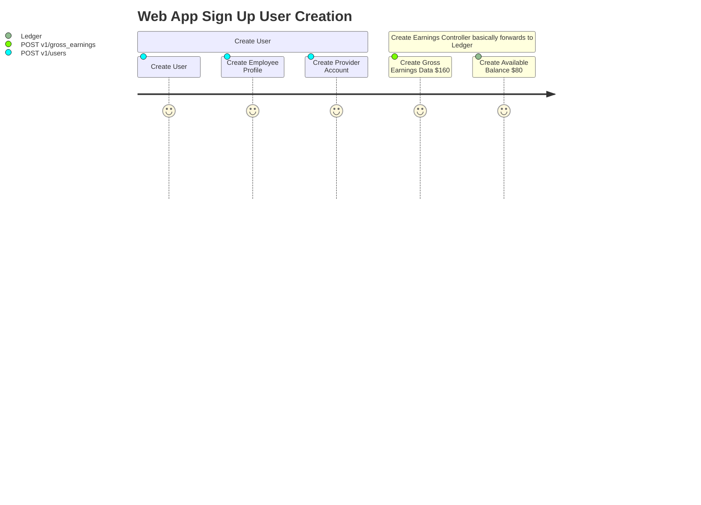

# example-repo

```mermaid
  graph TD;
    A-->B;
    A-->C;
    B-->D;
    C-->D;
```

```mermaid
    journey
        title Web App Sign Up User Creation
        section Create User
        Create User: 7: POST v1/users
        Create Employee Profile: 7: POST v1/users
        Create Provider Account: 7: POST v1/users
        section Create Earnings Controller basically forwards to Ledger
        Create Gross Earnings Data $160: 7: POST v1/gross_earnings
        Create Available Balance $80: 7: Ledger
```
