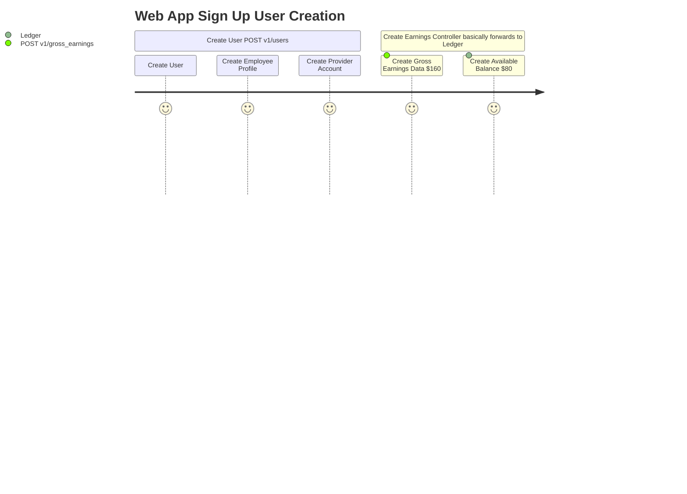
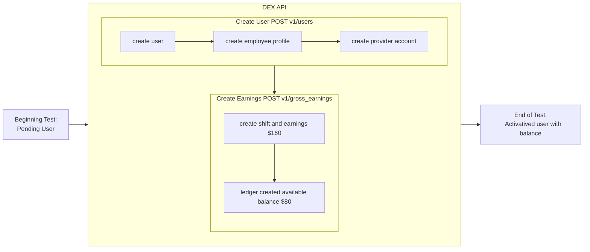

# example-repo

```mermaid
  graph TD;
    A-->B;
    A-->C;
    B-->D;
    C-->D;
```

```mermaid
    journey
        title Web App Sign Up User Creation
        section Create User POST v1/users
        Create User: 7
        Create Employee Profile: 7
        Create Provider Account: 7
        section Create Earnings Controller basically forwards to Ledger
        Create Gross Earnings Data $160: 7: POST v1/gross_earnings
        Create Available Balance $80: 7: Ledger
```

```mermaid
  flowchart LR
    subgraph TOP[DEX API]
      direction TB
      subgraph B1[Create User POST v1/users]
          direction LR
          i1[create user] -->f1[create employee profile]-->f3[create provider account]
      end
      subgraph B2[Create Earnings POST v1/gross_earnings]
          direction TB
          i2[create shift and earnings $160] -->f2[ledger created available balance $80]
      end
    end
    A[Beginning Test:
    Pending User] --> TOP --> B[End of Test:
    Activatived user with balance]
    B1 --> B2
```
